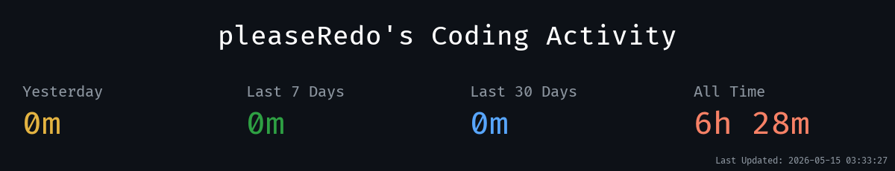
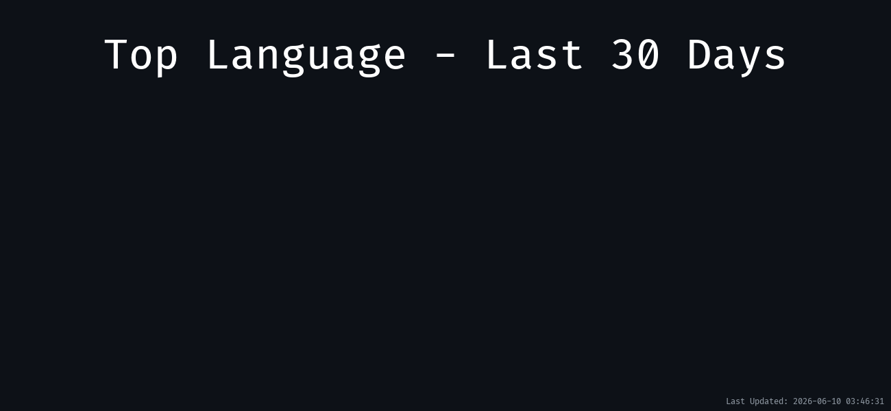
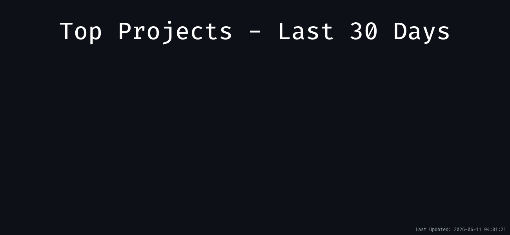
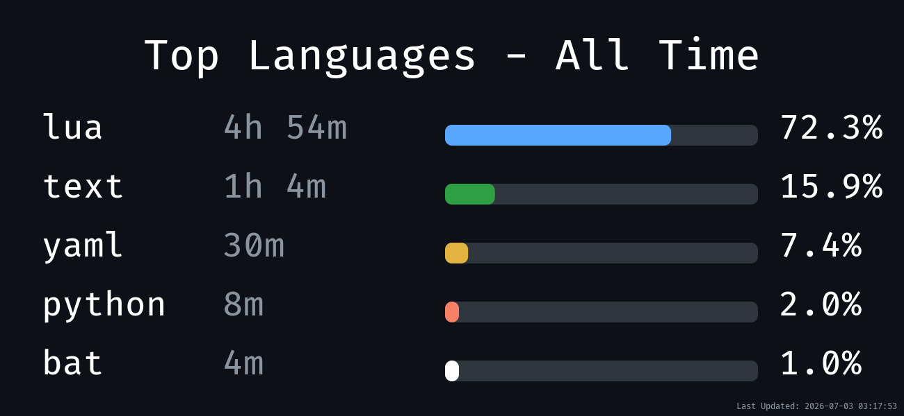
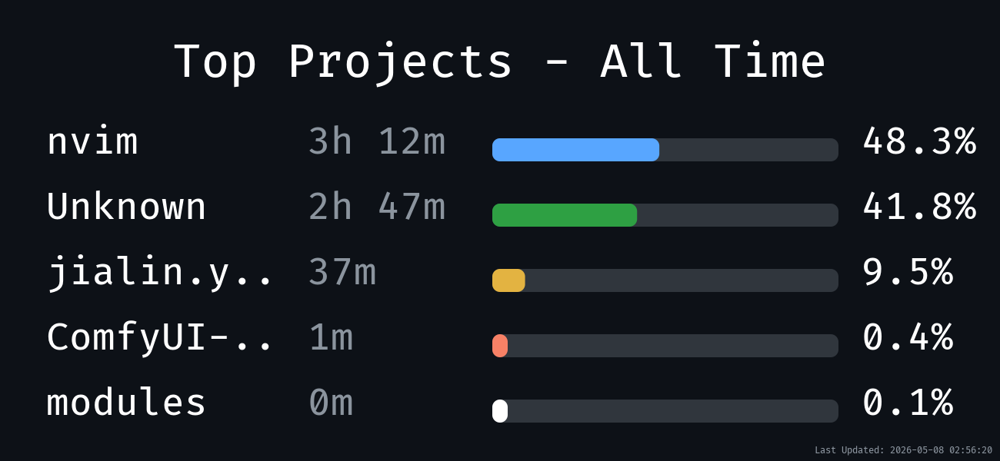
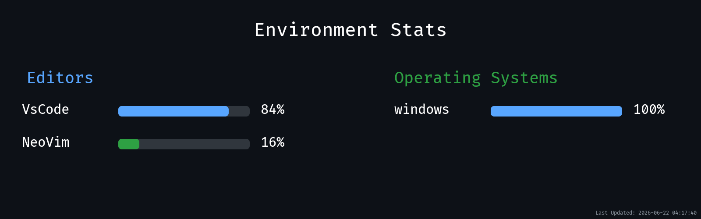

## Hi there 👋

<!--
**pleaseRedo/pleaseRedo** is a ✨ _special_ ✨ repository because its `README.md` (this file) appears on your GitHub profile.

Here are some ideas to get you started:

- 🔭 I’m currently working on ...
- 🌱 I’m currently learning ...
- 👯 I’m looking to collaborate on ...
- 🤔 I’m looking for help with ...
- 💬 Ask me about ...
- 📫 How to reach me: ...
- 😄 Pronouns: ...
- ⚡ Fun fact: ...
-->
<!--takatime-start-->

<h2 align="center">TakaTime Weekly Report</h2>

<p align="center">
  <br/>
  
  <br/>
  
  <br/>
  
</p>

<p align="center"><em>Generated automatically by <a href="https://github.com/Rtarun3606k/TakaTime">TakaTime</a></em></p>

<!--takatime-end-->

<!--START_SECTION:waka-->

```rust
From: 02 March 2026 - To: 29 April 2026

Total Time: 21 hrs 49 mins

Lua         13 hrs 28 mins        >>>>>>>>>>>>>------------   53.22 %
Python      4 hrs 53 mins         >>>>>--------------------   19.35 %
Other       3 hrs 28 mins         >>>----------------------   13.75 %
```

<!--END_SECTION:waka-->
